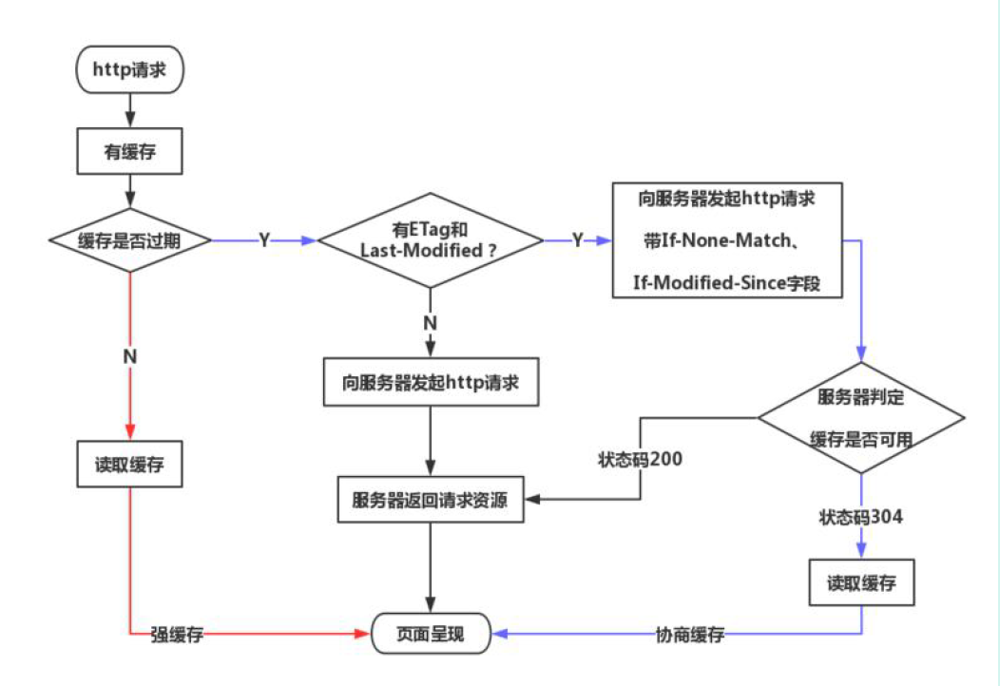

# 计算机网络知识点

计算机网络的知识点包括http、https、浏览器的重排重绘、tcp三次握手四次挥手等

## OSI七层结构

1.  应用层：文件传输协议(http\smtp\ftp)
2.  表示层
3.  会话层：建立或者解除会话
4.  传输层：TCP\UDP
5.  网络层：IP\ICMP
6.  数据链路层：传输有地址的帧
7.  物理层

## TCP和UDP

1.  tcp是面向连接的，udp是无连接的
2.  tcp是提供可靠连接的，通过tcp传输的数据无差错、不丢失、不重复且按序到达；udp尽最大努力交付，不保证可靠交付。
3.  tcp面向字节流的，udp面向报文
4.  tcp首部有20个字节，udp首部仅8字节
5.  tcp支持1对1连接，udp支持1对1、1对多

## 三次握手和四次挥手

三次握手之所以三次是要保证client和server均让对方知道自己接收和发送的能力没有问题而保证的最小次数。为保证这种能力，每次握手都会携带一个seq标识，接收方接收到后设置ack=seq+1，并置ACK=1

1.  C->S server只能判断client具备发送能力
2.  S->C client判断出server具有接收和发布能力
3.  C->S 双方均保证接收和发送能力没问题

## 跨域的方法

1.  JSONP：动态创建<script>标签并带上请求接口发送跨域请求，只能用get方法
2.  CORS：后端设置Access-allow-origin-control='*'即可
3.  postMessage
4.  iframe+document.domain

## 重排和重绘

引起重排重绘的时机：
1.  添加或删除可见DOM元素
2.  元素位置发生变化
3.  元素尺寸发生变化
4.  内容发生变化，如文本被图片替代
5.  窗口尺寸变化
6.  页面渲染时

**重排一定会引起重绘，重绘不一定引起重排**

### 重排(回流)

生成渲染树后需要计算节点在设备视口(viewport)中的确切位置和大小，这个计算阶段就是回流。

### 重绘

通过回流阶段知道可视节点和可视节点具体的位置和大小后，需要将每个节点转换为屏幕上的实际像素，这个阶段叫做重绘。

### 优化方法

1.  批量修改DOM
2.  避免触发同步布局事件
3.  对于复杂动画效果，使用绝对定位脱离文档流
4.  css3硬件加速

## http和https

http: http是超文本传输协议，是互联网上应用最广泛的一种网络协议，是一个客户端和服务器请求和应答的标准。

https: 是以安全为目标的http协议，加入了SSL层，以SSL安全协议为基础。建立信息安全通道来确保数据传输并确保网站真实性。

### http和https的区别

http是明文传输未加密通信的，网景公司设置了SSL协议对http协议传输的内容进行加密，并进行身份认证，比http协议安全性能高。

1.  https协议使用ca证书，费用较高
2.  http明文传输，https使用ssl协议加密
3.  链接方式不同，端口也不同，http是80端口、https是443端口
4.  http连接简单无状态、https加密传输、身份认证

### 工作原理

1.  客户端给出协议版本号、一个随机生成的数、客户端支持的加密方法给服务端
2.  服务端确认使用的加密方法，并给出数字证书ca以及服务器生成的随机数
3.  客户端确认证书有效，生成新的随机数，并使用证书中的公钥加密随机数并发给服务端
4.  服务端使用自己的私钥解密随机数
5.  客户端与服务端根据约定的加密方法，使用前面三个随机数生成会话密钥，用来加密接下来的整个会话流程

## http1.0、http1.1、http2.0的区别

### http1.0

无状态：服务器不跟踪不记录请求过的状态
无连接：浏览器每次请求都需要建立tcp连接

### http1.1

长连接：新增Connection字段，可以设置keep-alive值保持连接不断开
管道化：基于长连接的基础，管道化可以不等第一个请求响应继续发送后面的内容，但响应的顺序还是按请求的顺序返回
缓存处理：增加cache-control字段
断点传输：上传/下载的资源过大时分割为多个部分分别上传/下载

### http2.0

二进制分帧：将所有传输信息分割为更小的消息和帧，并用二进制形式编码
多路复用：共享TCP链接的基础上同时发送请求和响应，同一域名下的所有访问都由同一个TCP连接中走，http消息被分解为独立的帧，乱序发送，服务端根据标识符和首部将消息重新组装
头部压缩
服务推送：服务器可以额外向客户端推送资源而无需客户端明确请求

## 从url输入到显示页面的过程

1.  查看浏览器缓存中是否有url对应的ip记录，没有会依次从系统缓存->路由器缓存->DNS服务器中找
2.  根据ip和端口构造http请求并封入tcp包中
3.  经过传输层、网络层、数据链路层、物理层到达服务器
4.  服务器解析请求并返回响应和html给浏览器
5.  浏览器根据html构建DOM树，遇到JS脚本和外部JS连接会阻塞并执行脚本
6.  如遇到<style>标签或者<link>标签(先下载后构建)时根据外部样式、内部样式、内联样式构建CSSOM树并不影响DOM树构建
7.  DOM树与CSSOM树合并为渲染树
8.  进行回流(Layout)得到节点的几何信息
9.  进行重绘(Painting)根据渲染树和回流得到的信息得到节点的绝对像素
10. 将像素发送给GPU展示在页面上

## HTTP缓存机制

浏览器在第一次发送请求后，服务器会在响应头中添加与缓存相关的字段：last-modified、expires、cache-control、ETag、Date

1.  强缓存: 直接从本机获取缓存，不需要向服务器发送请求
2.  协商缓存: 浏览器发送请求给服务器，服务器判断是否可使用本地缓存

